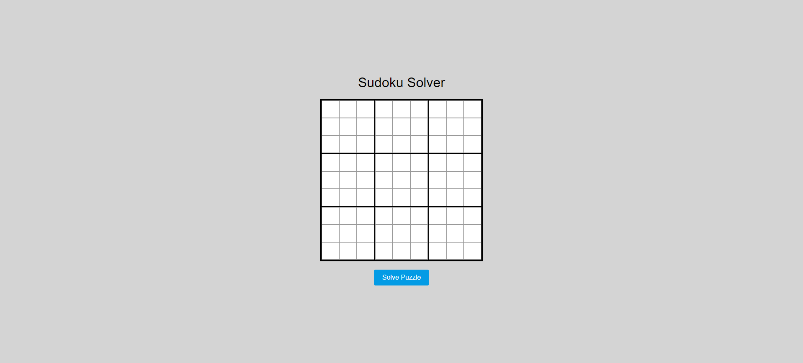

# Sudoku 

Sudoku is a popular number puzzle game that has gained immense popularity worldwide. It is a classic logic-based combinatorial number-placement puzzle. The objective of the game is to fill a 9x9 grid with digits so that each column, each row, and each of the nine 3x3 subgrids (also known as "regions" or "boxes") contains all of the digits from 1 to 9. The puzzle starts with some cells already filled with numbers, and the player must use logic and deduction to complete the grid.

Here are the key elements and rules of Sudoku:

1. **Grid Structure:**
   - The Sudoku grid is a 9x9 matrix, divided into nine 3x3 subgrids.
   - The grid is initially populated with some given numbers, referred to as "clues."

2. **Objective:**
   - The goal is to fill in the empty cells with numbers from 1 to 9, following the rules of the game.
   - Each row, column, and 3x3 subgrid must contain all the digits from 1 to 9 without repetition.

3. **Rules:**
   - A number can appear only once in each row.
   - A number can appear only once in each column.
   - A number can appear only once in each 3x3 subgrid.

4. **Difficulty Levels:**
   - Sudoku puzzles come in various difficulty levels, ranging from easy to expert.
   - The difficulty is determined by the number and placement of initial clues, affecting the complexity of the logical deductions required to solve the puzzle.

5. **Logic and Deduction:**
   - Sudoku is a game of pure logic. No mathematics or special arithmetic skills are required.
   - Players use deductive reasoning and elimination strategies to determine the correct placement of numbers in each cell.

6. **Solving Techniques:**
   - Players commonly use techniques such as "single candidate," "naked pairs," "hidden singles," and more to solve puzzles.
   - Advanced strategies may involve "X-wing," "swordfish," and other complex patterns.

7. **Variations:**
   - While the classic 9x9 Sudoku is the most well-known, variations exist with different grid sizes, shapes, and rule modifications.
   - Some Sudoku variants may have additional constraints, such as diagonal Sudoku, samurai Sudoku, and more.

8. **Popularity:**
   - Sudoku gained widespread popularity in the early 2000s, thanks to its inclusion in newspapers, puzzle books, and online platforms.
   - It has become a favorite pastime for people of all ages, providing a challenging yet relaxing mental exercise.

9. **Online Platforms and Apps:**
   - Sudoku is readily available on various online platforms, allowing players to solve puzzles digitally.
   - There are dedicated Sudoku apps for mobile devices, providing a convenient way to play on the go.

Sudoku's appeal lies in its simplicity, yet it offers a deep and satisfying challenge for puzzle enthusiasts. It serves as an excellent exercise for the mind, promoting logical thinking, pattern recognition, and patience. Whether played in newspapers, puzzle books, or digital formats, Sudoku continues to be a timeless and engaging game for individuals seeking a mental workout.

# Sudoku Solver

JavaScript code is an implementation of a Sudoku solver using a backtracking algorithm. Here's a brief explanation of the key components:

1. **Initialization on DOMContentLoaded:**
   - The code starts by setting up an event listener for when the DOM is fully loaded.
   - It creates a 9x9 Sudoku grid with input cells and a "Solve" button.
   - Each input cell has a unique ID in the format `cell-row-col`.

2. **solveSudoku Function:**
   - This function is called when the "Solve" button is clicked.
   - It reads the user-input values from the grid and fills a 2D array (`sudokuArray`) accordingly.
   - User-input cells are identified and marked with a CSS class.
   - It then calls `solveSudokuHelper` to attempt solving the Sudoku.

3. **solveSudokuHelper Function:**
   - This is a recursive backtracking function to solve the Sudoku puzzle.
   - It iterates through each cell, attempting to place numbers 1 through 9.
   - If a valid number is found, it proceeds to solve the rest of the puzzle recursively.
   - If the puzzle is solved, it returns `true`. If no valid number is found, it backtracks and returns `false`.

4. **isValidMove Function:**
   - Checks if placing a number at a given position is valid in terms of Sudoku rules.
   - It checks the row, column, and the 3x3 subgrid for conflicts.
   - Returns `true` if the move is valid, and `false` if there is a conflict.

5. **sleep Function:**
   - Introduces a delay for visualization purposes when filling in the solved values. It uses the `await sleep(20)` line.

6. **CSS Classes:**
   - The code uses CSS classes like "user-input" and "solved" to style the grid cells based on user input and the solution.

7. **Alert for No Solution:**
   - If no solution is found, an alert is shown indicating that no solution exists for the given Sudoku puzzle.

The backtracking algorithm allows the solver to explore different possibilities and backtrack when it encounters conflicts, ultimately finding a solution to the Sudoku puzzle. The code also includes visual effects to display the solved values with a slight delay.

# WebApp Preview

